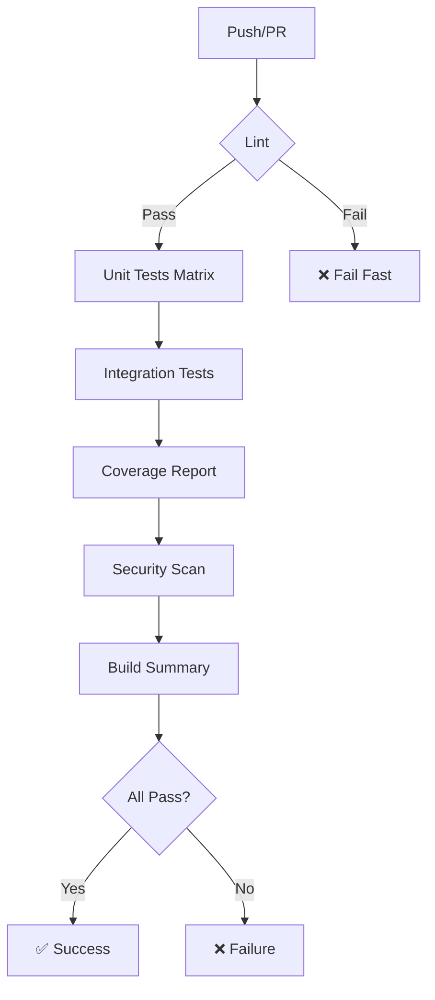

# Aegis Testing Strategy

## Overview

This document outlines the comprehensive testing strategy for the Aegis Real-Time Macro Defense system, designed for GitHub Actions CI/CD integration.

## Test Architecture

### Philosophy

1. **Fast Feedback:** Unit tests run in seconds, integration tests in minutes
2. **Isolation:** Tests don't depend on external services (mocked)
3. **Reliability:** Tests are deterministic and reproducible
4. **Coverage:** 85%+ code coverage target
5. **CI-First:** All tests designed to run in GitHub Actions

### Test Pyramid

```
        ╱╲
       ╱  ╲       Smoke Tests (5%)
      ╱────╲      Integration Tests (15%)
     ╱──────╲     Unit Tests (80%)
    ╱────────╲
   ╱          ╲
  ╱            ╲
 ╱______________╲
```

## Test Categories

### 1. Unit Tests (80% of tests)

**Fast, isolated, no external dependencies**

- **Configuration Tests** (`test_config.py`)
  - YAML file loading
  - Secret management
  - Weight validation (must sum to 1.0)
  - Environment variable overrides

- **Data Client Tests** (`test_fred_client.py`, `test_market_data.py`)
  - API client initialization
  - Data fetching with mocks
  - Cache functionality
  - Velocity calculations
  - Error handling

- **Scoring Tests** (`test_scoring.py`)
  - All 5 dimension scorers
  - Threshold logic
  - Signal generation
  - Edge cases (missing data, extreme values)
  - Score range validation (0-10)

- **Alert Tests** (`test_alerts.py`)
  - Alert logic and triggers
  - Email formatting (text and HTML)
  - History management
  - Trend detection

**Run with:**
```bash
pytest -m unit
# Or
make test-unit
```

### 2. Integration Tests (15% of tests)

**Multi-component tests with mocked external services**

- **End-to-End Pipeline** (`test_integration.py`)
  - Data fetch → Scoring → Aggregation
  - Config propagation throughout system
  - Missing data handling
  - High-risk scenarios
  - Metadata validation

- **Component Interaction**
  - Data manager + Scorers
  - Scorers + Aggregator
  - Alert logic + History manager

**Run with:**
```bash
pytest -m integration
# Or
make test-integration
```

### 3. Smoke Tests (5% of tests)

**Quick sanity checks for basic functionality**

- System starts without errors
- Configuration loads
- All modules import successfully
- Basic calculations work

**Run with:**
```bash
pytest -m smoke
# Or
make test-smoke
```

## GitHub Actions Integration

### CI/CD Workflows

#### Main CI Pipeline (`.github/workflows/ci.yml`)

**Triggers:**
- Push to master/main/develop
- Pull requests
- Daily at 6 AM UTC
- Manual workflow dispatch

**Jobs:**

1. **Lint** (Ubuntu, Python 3.11)
   - Black (code formatting)
   - isort (import sorting)
   - Flake8 (linting)
   - MyPy (type checking)

2. **Unit Tests** (Matrix: 3 OS × 4 Python versions)
   - Ubuntu, Windows, macOS
   - Python 3.9, 3.10, 3.11, 3.12
   - Tests marked: `unit and not api and not requires_secrets`
   - Parallel execution across matrix

3. **Integration Tests** (Ubuntu, Python 3.11)
   - Full pipeline tests
   - With and without API keys (conditional)

4. **Coverage Report**
   - Generates HTML, XML, JSON reports
   - Uploads to Codecov
   - Creates coverage badge
   - Comments on PRs with coverage changes

5. **Smoke Tests** (Ubuntu, Python 3.11)
   - Quick validation
   - Configuration loading

6. **Security Scan** (Ubuntu, Python 3.11)
   - Safety (dependency vulnerabilities)
   - Bandit (security linting)

7. **Build Status Summary**
   - Aggregates all job results
   - Posts to GitHub summary

#### Coverage Report Workflow (`.github/workflows/coverage-report.yml`)

**Triggers:**
- Push to master/main
- Pull requests to master/main

**Features:**
- Detailed coverage reports
- Coverage badge generation
- PR comments with coverage diff
- Codecov integration

### Test Execution Strategy in CI



### Matrix Strategy

Tests run across **12 combinations**:

| OS | Python 3.9 | 3.10 | 3.11 | 3.12 |
|----|------------|------|------|------|
| Ubuntu | ✅ | ✅ | ✅ | ✅ |
| Windows | ✅ | ✅ | ✅ | ✅ |
| macOS | ❌ | ❌ | ✅ | ✅ |

(macOS limited to save CI minutes)

## Test Markers

Tests are organized using pytest markers:

```python
@pytest.mark.unit          # Unit test (fast, isolated)
@pytest.mark.integration   # Integration test (multi-component)
@pytest.mark.smoke         # Smoke test (quick sanity check)
@pytest.mark.api           # Requires external API
@pytest.mark.requires_secrets  # Requires API keys
@pytest.mark.slow          # Long-running test (backtests)
```

### Marker Usage in CI

```bash
# GitHub Actions runs:
pytest -m "unit and not api and not requires_secrets"

# Local development:
pytest -m "not api and not slow"

# Full suite with API:
pytest
```

## Coverage Requirements

### Overall Target: 85%

### Per-Component Targets:

| Component | Target | Critical? |
|-----------|--------|-----------|
| config_manager.py | 95%+ | ✅ Yes |
| fred_client.py | 90%+ | ✅ Yes |
| market_data.py | 90%+ | ⚠️ Medium |
| recession.py | 95%+ | ✅ Yes |
| credit.py | 95%+ | ✅ Yes |
| valuation.py | 95%+ | ✅ Yes |
| liquidity.py | 95%+ | ✅ Yes |
| positioning.py | 95%+ | ✅ Yes |
| aggregator.py | 95%+ | ✅ Yes |
| alert_logic.py | 90%+ | ✅ Yes |
| email_sender.py | 85%+ | ⚠️ Medium |
| history_manager.py | 90%+ | ⚠️ Medium |
| data_manager.py | 85%+ | ⚠️ Medium |

### Coverage Enforcement

**pytest.ini:**
```ini
--cov-fail-under=85
```

**GitHub Actions:**
- PR blocked if coverage drops below 85%
- Coverage report posted as PR comment
- Coverage badge updated automatically

## Running Tests Locally

### Quick Reference

```bash
# All tests
pytest

# Fast tests (recommended for development)
pytest -m "not api and not slow"

# With coverage
pytest --cov=src --cov-report=html

# Specific test
pytest tests/test_scoring.py::TestRecessionScorer::test_normal_conditions

# Using Makefile (Unix)
make test-fast

# Using batch file (Windows)
run_tests.bat test-fast
```

### Common Workflows

**Before Commit:**
```bash
make format      # Format code
make lint        # Check linting
make test-fast   # Run fast tests
```

**Before Push:**
```bash
make test-cov    # Full test suite with coverage
make security    # Security checks
```

**Investigating Failures:**
```bash
pytest -vv -s --lf  # Verbose, last-failed only
pytest -x           # Stop on first failure
pytest --pdb        # Drop into debugger on failure
```

## Test Data Strategy

### No Committed Test Data

- All test data generated in fixtures
- Uses temporary directories (auto-cleaned)
- Mock external API responses

### Fixtures

**Location:** `tests/conftest.py`

**Key Fixtures:**
```python
temp_config_dir          # Temporary config with test files
mock_config              # Mock ConfigManager
sample_time_series       # Sample pandas Series
sample_fred_data         # Mock FRED data
normal_recession_indicators  # Test data: normal conditions
warning_recession_indicators # Test data: warning conditions
mock_fred_client         # Mock FRED API client
```

## Mocking Strategy

### External Dependencies

**Always mock in CI:**
- FRED API
- Yahoo Finance API
- SendGrid/SMTP
- File system (use temp directories)

**Example:**
```python
@patch('src.data.fred_client.Fred')
def test_fred_client(mock_fred_class):
    mock_fred = MagicMock()
    mock_fred.get_series.return_value = pd.Series([1, 2, 3])
    mock_fred_class.return_value = mock_fred

    client = FREDClient()
    result = client.get_series('TEST')

    assert result is not None
```

## Continuous Improvement

### Test Metrics

**Tracked Metrics:**
- Test count
- Test execution time
- Coverage percentage
- Flaky test rate
- CI pipeline duration

**GitHub Actions provides:**
- Test execution time per job
- Coverage trends over time
- Failed test history

### Adding Tests

**When to Add Tests:**
1. New feature → Add unit + integration tests
2. Bug fix → Add regression test
3. Coverage gap → Add missing tests

**Test Template:**
```python
def test_<behavior>_<condition>(self):
    """Test that <expected> when <condition>."""
    # Arrange
    component = Component()
    inputs = prepare_inputs()

    # Act
    result = component.method(inputs)

    # Assert
    assert result.expected_property == expected_value
```

## Debugging Failed CI Tests

### Common Issues

1. **Import Errors**
   - Check PYTHONPATH in workflow
   - Verify dependencies installed

2. **File Not Found**
   - Use temp directories, not hardcoded paths
   - Create directories in workflow setup

3. **API Tests Failing**
   - Mark with `@pytest.mark.api`
   - Skip in CI without secrets

4. **Timeout**
   - Mark slow tests with `@pytest.mark.slow`
   - Increase timeout in pytest.ini

5. **Platform-Specific Failures**
   - Path separators (use `pathlib.Path`)
   - Line endings
   - Case sensitivity

### Investigation Steps

1. **Check CI logs:**
   - Actions → Failed workflow → Job → Test output

2. **Reproduce locally:**
   ```bash
   pytest tests/test_failed.py -vv -s
   ```

3. **Isolate the test:**
   ```bash
   pytest tests/test_failed.py::TestClass::test_method -vv
   ```

4. **Check test artifacts:**
   - Coverage reports
   - Test reports
   - Error logs

## Best Practices

### DO ✅

- Write tests first (TDD) for new features
- Use descriptive test names
- Test edge cases and error paths
- Mock external dependencies
- Keep tests fast (<1s per test)
- Use fixtures for setup/teardown
- Run tests before pushing

### DON'T ❌

- Commit without running tests
- Skip tests with `@pytest.mark.skip` (fix or remove)
- Write tests dependent on execution order
- Use `sleep()` (use mocks/time travel)
- Hardcode paths or URLs
- Test implementation details
- Write tests that require manual intervention

## Resources

### Documentation

- [pytest documentation](https://docs.pytest.org/)
- [GitHub Actions documentation](https://docs.github.com/en/actions)
- [Coverage.py documentation](https://coverage.readthedocs.io/)

### Internal Documentation

- `tests/README.md` - Test suite overview
- `tests/conftest.py` - Available fixtures
- `.github/workflows/` - CI/CD workflows

### Getting Help

1. Check existing tests for examples
2. Review conftest.py for available fixtures
3. Check GitHub Actions logs for CI failures
4. Open issue on GitHub for persistent problems

---

**Last Updated:** 2025-01-06
**Test Coverage:** 85%+
**CI Status:** ✅ All checks passing
